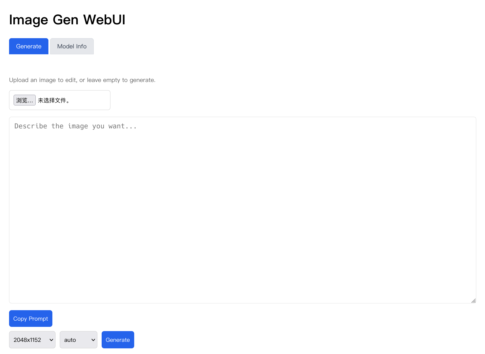
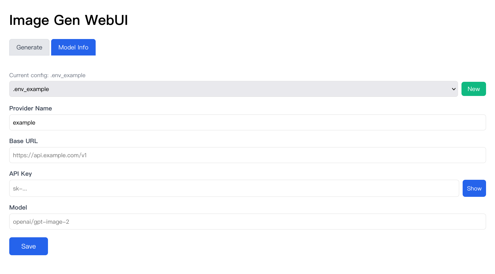

# Image-Gen-WebUI

[中文](README_CN.md)

> **Disclaimer:** This software is provided "as is", without warranty of any kind. Use at your own risk. By using this software you agree that the author is not liable for any damages, data loss, or API credit charges arising from its use.

A lightweight local web UI for text-to-image generation and image editing using an OpenAI-compatible API. Runs entirely on localhost — no images or credentials leave your machine beyond the API provider.

## Contents

- [How It Works](#how-it-works)
- [Features](#features)
- [Screenshots](#screenshots)
- [Quick Start](#quick-start)
- [Manual Setup](#manual-setup)
- [Configuration](#configuration)
- [Project Structure](#project-structure)
- [Scripts Reference](#scripts-reference)
- [Dependencies](#dependencies)
- [Security](#security)
- [License](#license)

## How It Works

```
 Browser (127.0.0.1:5000)
        │
   ┌────▼─────┐     .env_* configs      ┌────────────────┐
   │  Flask   │◄────────────────────────│  API Provider  │
   │ (app.py) │     OpenAI SDK          │  (remote)      │
   └────┬─────┘                         └────────────────┘
        │
   ┌────▼────┐     ┌────────┐
   │ outputs/│     │uploads/│
   └─────────┘     └────────┘
```

1. User opens `http://127.0.0.1:5000` and fills in a prompt
2. **Text → Image**: Flask calls `client.images.generate()` via the configured API provider
3. **Image → Image**: User uploads an image → Flask calls `client.images.edit()`
4. API returns a base64-encoded PNG → Flask decodes and saves to `outputs/`
5. Result page shows the image with download link and history gallery

## Features

- Text-to-image generation
- Image editing / variation with prompt
- Resolution support: 1024x1024 up to 3840x2160
- Quality selection (auto / low / medium / high)
- **Multi-profile configuration** — switch between different API providers in the Web UI
- **Model Info editor** — create, edit, and switch `.env_*` config files from the browser
- History gallery (last 20 generated images)
- Lightbox preview, one-click download
- Delete to trash (uses system trash instead of permanent removal)
- Loading indicator during generation
- Prompt copy helper

## Screenshots

### Generate Tab



### Model Info Tab



## Quick Start

**Linux / macOS:**

```bash
./run.sh
```

**Windows (PowerShell):**

```powershell
.\run.ps1
```

The script will auto-detect Python 3, create a `.venv` virtual environment, install dependencies, start the server, and open your browser.

On first launch, the app will detect no configuration and automatically switch to the **Model Info** tab where you can create your first profile.

## Manual Setup

**Linux / macOS:**

```bash
python3 -m venv .venv
source .venv/bin/activate
pip install -r requirements.txt
python app.py
```

**Windows (PowerShell):**

```powershell
python -m venv .venv
.\.venv\Scripts\Activate.ps1
pip install -r requirements.txt
python app.py
```

Then open: http://127.0.0.1:5000

## Configuration

Configuration is managed through `.env_*` files in the project root, edited via the **Model Info** tab in the Web UI. Each file stores one API provider's settings:

```ini
provider_name=my_provider
base_url=https://api.example.com/v1
api_key=sk-xxxxxxxxxxxxxxxx
model=openai/gpt-image-2
```

The active profile is tracked in `.env_current` (a single-line file pointing to the active `.env_*` file). You can create multiple profiles (e.g., `.env_cherryin`, `.env_openai`) and switch between them in the UI.

Alternatively, create these files manually:

```bash
echo "provider_name=cherryin"      > .env_cherryin
echo "base_url=https://open.cherryin.net/v1" >> .env_cherryin
echo "api_key=sk-xxx"             >> .env_cherryin
echo "model=openai/gpt-image-2"    >> .env_cherryin
echo ".env_cherryin"               > .env_current
```

All `.env_*` files and `.env_current` are **git-ignored** — never commit or share them.

## Project Structure

<details>
<summary>Click to expand</summary>

```
Image-Gen-WebUI/
├── app.py                 # Flask web server (main entry point)
├── config_manager.py      # Shared config loader for all scripts
├── test_image_size.py     # Quick resolution compatibility tester
├── run.sh                 # One-click startup script (Linux/macOS)
├── run.ps1                # One-click startup script (Windows)
├── requirements.txt       # Python dependencies
├── templates/
│   └── index.html         # Single-page web UI (Jinja2 template)
├── .env_*                 # API provider configs (git-ignored)
├── .env_current           # Active profile pointer (git-ignored)
├── outputs/               # Generated images (git-ignored)
└── uploads/               # Uploaded source images (git-ignored)
```

</details>

## Scripts Reference

<details>
<summary>Click to expand</summary>

### `app.py` — Web UI

Main application. Serves the web interface and handles all API calls.

| Route | Method | Description |
|-------|--------|-------------|
| `/` | GET | Serve the web interface |
| `/` | POST | Generate or edit an image |
| `/outputs/<path>` | GET | Serve a generated image file |
| `/delete` | POST | Move an image to system trash |
| `/api/config` | GET | Get current config state (masked) |
| `/api/config/save` | POST | Save to a `.env_*` file |
| `/api/config/switch` | POST | Switch the active profile |
| `/api/config/new` | POST | Create a new `.env_*` file |

### `test_image_size.py` — Resolution Compatibility Tester

Quickly check which image sizes a provider's model actually supports. Edit `SIZES_TO_TEST` in the script to uncomment or add the resolutions you want to test, then run `python test_image_size.py`. Useful when onboarding a new API provider to verify supported resolutions before using the Web UI. Uses `config_manager.py` to load the active configuration.

### `config_manager.py` — Shared Configuration Module

Provides `load_current_config()`, `save_config()`, `switch_env()`, `get_client()`, and other helpers used by all Python scripts in the project.

### `run.sh` / `run.ps1` — One-Click Startup

Platform-specific launchers that automatically set up the virtual environment, install dependencies, start the server, and open the browser. `run.sh` for Linux/macOS, `run.ps1` for Windows PowerShell.

</details>

## Dependencies

- **Python** (>=3.9) — runtime
  - **Linux**: usually pre-installed (`python3 --version`)
  - **macOS**: install via [Homebrew](https://brew.sh) — `brew install python`
  - **Windows**: install via [Scoop](https://scoop.sh) + [WinPython](https://winpython.github.io) — `scoop bucket add versions && scoop install winpython`
- **Flask** (>=3.0) — web framework
- **openai** (>=1.0) — OpenAI SDK for API communication
- **send2trash** (>=1.8) — safe delete to system trash bin
- **Pillow** — image resolution verification (optional, used by test scripts)

## Security

- Server binds to **127.0.0.1 only** — not accessible from the network
- `debug=False` — Werkzeug debugger console is disabled
- `.env_*`, `.env_current`, `outputs/`, `uploads/`, `edit/` are all **git-ignored**
- API key is masked by default in the Web UI (password field + Show/Hide toggle)
- Proxy environment variables are stripped at startup to prevent request leakage
- This is a **personal local tool** — not intended for multi-user or networked deployment

## License

[MIT License](LICENSE) — Copyright (c) 2026 Shawn Z
